# RFC-0006: Visual Metaphors and Diagrams

| Field          | Value                                  |
| -------------- | -------------------------------------- |
| **RFC**        | 0006                                   |
| **Title**      | Visual Metaphors for CDO Understanding |
| **Status**     | Draft                                  |
| **Created**    | 2026-01-09                             |
| **Type**       | Informational                          |
| **Depends On** | RFC-0001                               |

---

## Abstract

This RFC provides visual metaphors and diagrams to aid understanding of the CDO framework. Abstract systems benefit from visual anchors that reduce cognitive load during initial comprehension.

---

## 1. The Hydraulic Analogy

### 1.1. Concept

CDO models traffic routing as **fluid flow through pipes**. Unlike traditional circuit breakers (binary valves: OPEN/CLOSED), CDO uses **analog resistance** (pipe constriction).

### 1.2. Visual Comparison

```mermaid
flowchart LR
    subgraph Traditional["Traditional Circuit Breaker"]
        direction LR
        S1[Source] --> V1{{"🔴 CLOSED<br/>Valve"}}
        V1 -.X.-> D1[Destination]
    end

    subgraph CDO["CDO Dynamic Impedance"]
        direction LR
        S2[Source] --> P1["Wide Pipe<br/>Low R"]
        S2 --> P2["Constricted<br/>High R"]
        P1 ==> D2[Destination]
        P2 -.-> D2
    end
```

### 1.3. Multi-Route Flow

```mermaid
flowchart LR
    Source["🌊 Traffic<br/>Source"]

    subgraph Routes["Available Routes"]
        direction TB
        RouteB["Route B<br/>━━━━━━━━━━<br/>Wide, Smooth<br/>R = 15"]
        RouteA["Route A<br/>╍╍╍╍╍╍╍╍╍╍<br/>Narrowed, Scarred<br/>R = 85"]
    end

    Dest["📍 Destination"]

    Source ==>|"80% flow"| RouteB
    Source -.->|"20% flow"| RouteA
    RouteB ==> Dest
    RouteA -.-> Dest

    style RouteB fill:#90EE90,stroke:#228B22,stroke-width:3px
    style RouteA fill:#FFB6C1,stroke:#DC143C,stroke-width:2px,stroke-dasharray: 5 5
```

### 1.4. Key Insight

| Traditional     | CDO                   |
| --------------- | --------------------- |
| Binary (ON/OFF) | Analog (0 → ∞)        |
| Sudden cutoff   | Gradual degradation   |
| All-or-nothing  | Proportional shedding |
| Flapping risk   | Smooth transitions    |

---

## 2. The Physics Engine Loop

### 2.1. Concept

CDO is not a reactive "if/else" decision tree. It is a **continuous state update loop** that computes resistance from telemetry.

### 2.2. Decision Cycle

```mermaid
flowchart TB
    subgraph Input["📡 Input Layer"]
        Tel["Telemetry Stream<br/>(lat, err, sat)"]
        Req["Request<br/>Voltage V"]
    end

    subgraph Physics["⚙️ Physics Engine"]
        direction TB
        Vec["1. Vectorize<br/>P(t) = [p_lat, p_err, p_sat]"]
        Mom["2. Momentum<br/>M(t) = ΔP / Δt"]
        Scar["3. Scar Update<br/>S(t) = decay + trauma"]
        Res["4. Impedance<br/>R = R_base + P·W + μM + S"]
    end

    subgraph Decision["🚦 Gate"]
        Comp{"V > R ?"}
        Pass["✅ FLOW"]
        Drop["❌ DROP"]
    end

    Tel --> Vec
    Vec --> Mom
    Mom --> Scar
    Scar --> Res
    Res --> Comp
    Req --> Comp
    Comp -->|Yes| Pass
    Comp -->|No| Drop

    style Pass fill:#90EE90
    style Drop fill:#FFB6C1
```

### 2.3. State Machine

```mermaid
stateDiagram-v2
    [*] --> BOOTSTRAP: Route Created

    BOOTSTRAP: Observer Mode
    BOOTSTRAP: R = R_bootstrap (fixed)
    BOOTSTRAP: M = undefined

    OPERATIONAL: Full Physics
    OPERATIONAL: R = computed
    OPERATIONAL: M = computed

    CIRCUIT_BREAKER: Hard Cutoff
    CIRCUIT_BREAKER: R = ∞
    CIRCUIT_BREAKER: Flow = 0

    BOOTSTRAP --> OPERATIONAL: tickCount ≥ N
    OPERATIONAL --> CIRCUIT_BREAKER: R ≥ R_break
    CIRCUIT_BREAKER --> OPERATIONAL: S < S_recovery AND P < P_safe
```

---

## 3. Temporal Behavior

### 3.1. Concept

CDO exhibits **proactive damping** (via momentum) and **hysteresis** (via scarring). Resistance rises BEFORE pressure peaks and stays elevated AFTER pressure drops.

### 3.2. Crisis Timeline

### 3.3. Phase Analysis

### 3.4. Key Observations

| Phase       | Pressure | Resistance         | Mechanism                  |
| ----------- | -------- | ------------------ | -------------------------- |
| Pre-crisis  | Rising   | **Rising faster**  | Momentum (dP/dt)           |
| Peak        | Maximum  | Maximum            | Pressure + Momentum + Scar |
| Post-crisis | Dropping | **Still elevated** | Scar tissue decay          |
| Recovery    | Baseline | Slowly returning   | Exponential decay          |

> **Critical Insight:** Momentum provides **proactive braking** (brake before wall).
> Scar tissue provides **hysteresis** (remember past trauma).

---

## 4. Pressure Vector Space

### 4.1. 3D Representation

```mermaid
flowchart TD
    subgraph Space["Pressure State Space"]
        direction TB
        Origin["Origin (0,0,0)<br/>Healthy State"]
        Critical["Boundary<br/>||P|| = P_crit"]
        Death["Corner (1,1,1)<br/>Total Failure"]
    end

    subgraph Components["Vector Components"]
        Lat["p_lat: Latency →"]
        Err["p_err: Errors ↑"]
        Sat["p_sat: Saturation ↗"]
    end

    Origin -.->|"trajectory"| Critical
    Critical -.->|"unchecked"| Death
```

### 4.2. Normalization via tanh

---

## 5. Summary of Metaphors

| Figure | Metaphor          | Key Insight                          |
| ------ | ----------------- | ------------------------------------ |
| §1     | Hydraulic pipes   | Analog resistance, not binary valves |
| §2     | Physics loop      | Continuous computation, not if/else  |
| §3     | Temporal behavior | Proactive (momentum) + Memory (scar) |
| §4     | Vector space      | 3D stress representation             |

---

## 6. References

- Original ASCII diagrams: `docs/0004-diagrams.md` (deprecated)
- Mathematical foundations: RFC-0001
- Temporal dynamics: RFC-0002 §3

---

## 7. Changelog

| Version | Date       | Changes                             |
| ------- | ---------- | ----------------------------------- |
| 0.1.0   | 2026-01-09 | Initial draft with Mermaid diagrams |
